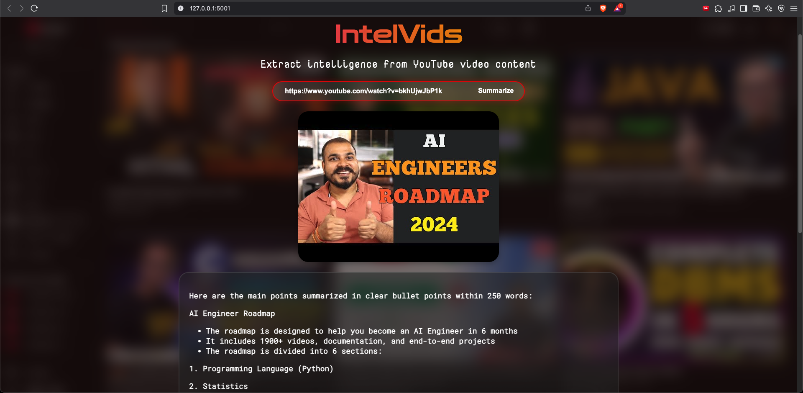

# IntelVids - Extract intelligence from YouTube video content

A Flask-based web application that summarizes YouTube videos using AI.



## Setup Instructions

1. Clone the repository:
```bash
git clone https://github.com/Nishantr846/IntelVids-YouTube-Video-Summarizer.git
cd IntelVids-YouTube-Video-Summarizer
```

2. Create a virtual environment and activate it:
```bash
python -m venv venv
source venv/bin/activate  # On Windows: venv\Scripts\activate
```

3. Install dependencies:
```bash
pip install -r requirements.txt
```

4. Create a `.env` file in the root directory and add your API key:
```bash
GROQ_API_KEY=your-api-key-here
```

5. Run the application:
```bash
python app.py
```

## Environment Variables

Create a `.env` file with the following variables:
- `GROQ_API_KEY`: Your Groq API key

## Security Note

Never commit your `.env` file or expose your API keys. The `.env` file is already in `.gitignore` to prevent accidental commits. 

## Contact

For any questions or feedback, feel free to reach out:

Author: Nishant Kumar
GitHub: [github.com/Nishantr846](https://github.com/Nishantr846)